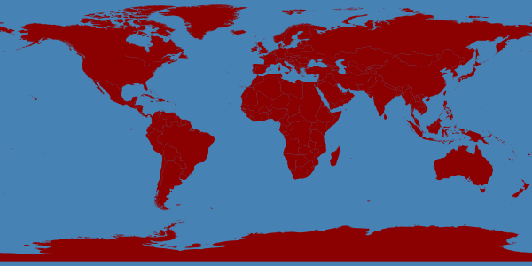
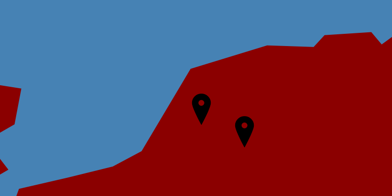

# Handling Vector data with Python

## GDAL/OGR using Python

By now you should now what the following abbreviation stand for (what can you do with it??).
Osgeo Python module groups 3 submodules:

* GDAL
* OGR

New: 
* OSR: spatial reference (projections!)

Documentation: 

* http://gdal.org/python/
* http://www.gdal.org/gdal_tutorial.html

Check out these relevant books:

* http://geospatialpython.com/

## OGR and the data drivers

OGR supports many different vector formats:

* ESRI formats such as shapefiles, personal geodatabases and ArcSDE
* Other software such as MapInfo, GRASS, Microstation
* Open formats such TIGER/Line, SDTS, GML, KML
* Databases such as MySQL, PostgreSQL, Oracle Spatial, etc.

**OGR Data drivers:** A driver is an object that knows how to interact with a certain data type (e.g. a shape file)
You know the right driver to read or write data. Some drivers might only read content but the majority can read and write.

```{r, engine='python'}
try:
  from osgeo import ogr
except:
  import ogr
```

From the terminal you can also type the following to obtain an overview of supported formats: 
```{r, eval=FALSE}
echo "Terminal command to obtain an overview of supported formats"
ogrinfo --formats
```

## Points

What does Wkt mean? 

```{r, engine='python'}
from osgeo import ogr
# Create a point geometry
wkt = "POINT (173914.00 441864.00)"
pt = ogr.CreateGeometryFromWkt(wkt)
print(pt)
# print help(osgeo.ogr)
```

## Define a spatial reference

See http://spatialreference.org/ref/epsg/wgs-84/ 

```{r, engine='python'}
from osgeo import osr
##  spatial reference
spatialRef = osr.SpatialReference()
spatialRef.ImportFromEPSG(4326)  # from EPSG - Lat/long
```

## Reproject a point

```{r, engine = 'python'}
from osgeo import ogr
from osgeo import osr

## lat/long definition
source = osr.SpatialReference()
source.ImportFromEPSG(4326)

# http://spatialreference.org/ref/sr-org/6781/
# http://spatialreference.org/ref/epsg/28992/
target = osr.SpatialReference()
target.ImportFromEPSG(28992)

transform = osr.CoordinateTransformation(source, target)
point = ogr.CreateGeometryFromWkt("POINT (5.6660 -51.9872)")
point.Transform(transform)
print point.ExportToWkt()
```

## Create a shape file

**Concept:**

* A point is a type of geometry stored as a feature.
* A layer can have many features.
* A datasource can have many layers.
* [The driver saves the datasource in a specific format](http://gdal.org/ogr/ogr_formats.html).

```{r, eval=FALSE}
Driver
    Datasource
        Layer
            Feature
                Geometry
                    Point
```

Start a new Python script within the `Python` console of QGIS (recommended for today!):

You can set the working directory using:
```{r, eval=FALSE}
import os
os.chdir('pathtoyourworkingdirectory')
print os.getcwd()
```

Now you can continue (you do not need to repead the `import os` if you have already done so!). More info about the different OGR formats (http://www.gdal.org/ogr_formats.html):

* Set spatial reference
* create shape file
* create layer
* create point
* Put point as a geometry inside a feature
* Put feature in a layer
* Flush

```{r, engine = 'python', eval=TRUE}
## Loading the modules
import os
os.chdir('data')

## Loading osgeo
try:
  from osgeo import ogr, osr
  print 'Import of ogr and osr from osgeo worked.  Hurray!\n'
except:
  print 'Import of ogr and osr from osgeo failed\n\n'

## Is the ESRI Shapefile driver available?
driverName = "ESRI Shapefile"
drv = ogr.GetDriverByName( driverName )
if drv is None:
    print "%s driver not available.\n" % driverName
else:
    print  "%s driver IS available.\n" % driverName

## choose your own name
## make sure this layer does not exist in your 'data' folder
fn = "testing.shp"
layername = "anewlayer"

## Create shape file
ds = drv.CreateDataSource(fn)
print ds.GetRefCount()

# Set spatial reference
spatialReference = osr.SpatialReference()
spatialReference.ImportFromProj4('+proj=longlat +ellps=WGS84 +datum=WGS84 +no_defs')

# you can also do the following
# spatialReference.ImportFromEPSG(4326)

## Create Layer
layer=ds.CreateLayer(layername, spatialReference, ogr.wkbPoint)
## Now check your data folder and you will see that the file has been created!
## From now on it is not possible anymore to CreateDataSource with the same name
## in your workdirectory untill your remove the name.shp name.shx and name.dbf file.
print(layer.GetExtent())

## What is the geometry type???
## What does wkb mean??

## ok lets leave the pyramid top and start building the bottom,
## let's do points
## Create a point
point1 = ogr.Geometry(ogr.wkbPoint)
point2 = ogr.Geometry(ogr.wkbPoint)

## SetPoint(self, int point, double x, double y, double z = 0)
point1.SetPoint(0,1.0,1.0) 
point2.SetPoint(0,2.0,2.0)

## Actually we can do lots of things with points: 
## Export to other formats/representations:
print "KML file export"
print point2.ExportToKML()

## Buffering
buffer = point2.Buffer(4,4)
print buffer.Intersects(point1)

## More exports:
buffer.ExportToGML()

## Back to the pyramid, we still have no Feature
## Feature is defined from properties of the layer:e.g:

layerDefinition = layer.GetLayerDefn()
feature1 = ogr.Feature(layerDefinition)
feature2 = ogr.Feature(layerDefinition)

## Lets add the points to the feature
feature1.SetGeometry(point1)
feature2.SetGeometry(point2)

## Lets store the feature in a layer
layer.CreateFeature(feature1)
layer.CreateFeature(feature2)
print "The new extent"
print layer.GetExtent()

## So what is missing ????
## Saving the file, but OGR doesn't have a Save() option
## The shapefile is updated with all object structure 
## when the script finished of when it is destroyed, 
# if necessay SyncToDisk() maybe used

ds.Destroy()
## below the output is shown of the above Python script that is run in the terminal
```

From the terminal you can remove the created "testing.shp" and related files using:

```{r, engine='bash', eval=TRUE}
echo "in the terminal you can use the following bash commands to easily remove files"
echo "list all the files starting with testing*"
ls data/testing*
echo "remove all the files starting with testing*"
rm -v data/testing*
```

Now, we can open the created shape file in QGIS using the `Python Console`.

```{r, engine='python', eval=FALSE}
## add a vector layer to the QGIS interface
qgis.utils.iface.addVectorLayer(fn, layername, "ogr") 
aLayer = qgis.utils.iface.activeLayer()
print aLayer.name()
```

The method `addVectorLayer` takes three arguments:

* the first argument is the path to the data source – the shapefile in our case
* the second argument is the basename – the name that the layer takes in the table of contents
* the third argument is the provider key. Basically, the function wants to know what driver will be used to read this data. 
For our purposes, “ogr” will be used most of the time with vector data.

Another example of how we can use this method:

`qgis.utils.iface.addVectorLayer('/home/user/Git/Python/data/testing.shp', 'anewlayer', "ogr")`


## Modify a shape file

Now let's try to add an extra point to the shape file:

```{r, engine='python', eval=FALSE}
ds = driver.Open(shp_file, 1)
## check layers and get the first layer
layernr = ds.GetLayerCount()
print layernr
layer = ds.GetLayerByIndex(0)
print layer

## get number of features in shapefile layer
features_number = layer.GetFeatureCount()
print "number of features for this layer:", features_number

## get the feature definition:
featureDefn = layer.GetLayerDefn()

## create a point
point = ogr.Geometry(ogr.wkbPoint)
point.SetPoint(0,2.0,1.0)
print point
## similarly 
## point.AddPoint(2,1)

## create a new feature
feature = ogr.Feature(featureDefn)
feature.SetGeometry(point)
# Lets store the feature in file
layer.CreateFeature(feature)
layer.GetExtent()
ds.Destroy()
```

## Convert a shapefile to JSON format

See here for an example:

* http://geospatialpython.com/2013/07/shapefile-to-geojson.html

If you want to learn more about GEOJSON:

* https://github.com/frewsxcv/python-geojson

## How to visualise a shape file? 

Mapnik is a Free Toolkit for developing mapping applications. It’s written in C++ and there are Python bindings to facilitate fast-paced agile development. It can comfortably be used for both desktop and web development. Mapnik is about making beautiful maps. It takes geospatial data from a PostGIS database, shapefile, or any other format supported by GDAL/OGR, and turns it into clearly-rendered, good-looking images. Among other things, it is used to render the five main Map layers on the [OpenStreetMap website](http://www.openstreetmap.org/).

Start by downloading the World Borders Dataset from:
http://thematicmapping.org/downloads/world_borders.php

```{r, engine='python', eval=FALSE}
import os,os.path
import mapnik

#First we create a map
map = mapnik.Map(600, 300) #This is the image final image size

#Lets put some sort of background color in the map
map.background = mapnik.Color("steelblue") # steelblue == #4682B4 

#To style the map we need to define a set or rules
#        Map
#  Style      Style
# Rule   Rule   Rule  Rule

# we normally start from the bottom creating an empty rule
rule = mapnik.Rule()

#1) rule that the polygon should be dark red
symbolizer = mapnik.PolygonSymbolizer(mapnik.Color("darkred"))
rule.symbols.append(symbolizer)

#2) The rule is added to the style
style = mapnik.Style()
style.rules.append(rule)

#3) Adding style to map, "mapStyle" is a simple name for our style
#Later we will define that our layer uses this style that is stored on the maps object
map.append_style("mapStyle", style)

#4) Adding the data first step is creating a layer, a map has mutiple layers
layer = mapnik.Layer("mapLayer")
layer.datasource = mapnik.Shapefile(file=os.path.join("data",
                                        "world_borders.shp"))
layer.styles.append("mapStyle")

#map.append_style("mapStyle", style)

#5) The current layer is not yet associated to the map 
map.layers.append(layer)

#6) Zoom to full extend of layers and dump content
map.zoom_all()
mapnik.render_to_file(map, os.path.join("figs",
                                        "map.png"), "png")
print "All done - check content"
```




# What have we learned?

1. Get or create a writeable layer 
2. Add fields if necessary
3. Create a feature
4. Populate the feature
5. Add the feature to the layer 
6. Close the layer
7. Modify a Shape file
8. Visualise a vector object using Python

# Assignment

Now create your own shape file containing two locations (e.g. a location of the GAIA building in Wageningen). E.g. go to Google Earth, an extract the coordinates and redo the above excercise (BONUS: if you use a `for` loop) and export to a KML file.

You can also use the points defined here: https://geoscripting-wur.github.io/IntroToVector/. 

Bonus: you can create a map with MapNik using the code below.

You can download:

* your own `location icon` from: https://sites.google.com/site/gmapicons/home
* the data set from http://www.naturalearthdata.com/downloads/110m-physical-vectors/

## Deadline

Upload your documented and well structured Python script to a GitHub repository and send the link before 1030 on Friday 23/01.

## Demoscript

```{r, engine='python', eval=FALSE}
import os,os.path
import mapnik

#file with symbol for point
file_symbol=os.path.join("figs","google_icon.png")

#First we create a map
map = mapnik.Map(800, 400) #This is the image final image size

#Lets put some sort of background color in the map
map.background = mapnik.Color("steelblue") # steelblue == #4682B4 

#Create the rule and style obj
r = mapnik.Rule()
s = mapnik.Style()

polyStyle= mapnik.PolygonSymbolizer(mapnik.Color("darkred"))
pointStyle = mapnik.PointSymbolizer(mapnik.PathExpression(file_symbol))
r.symbols.append(polyStyle)
r.symbols.append(pointStyle)

s.rules.append(r)
map.append_style("mapStyle", s)

# Adding point layer
layerPoint = mapnik.Layer("pointLayer")
layerPoint.datasource = mapnik.Shapefile(file=os.path.join("data",
                                        "twoLoopPoints.shp"))

layerPoint.styles.append("mapStyle")

#adding polygon
layerPoly = mapnik.Layer("polyLayer")
layerPoly.datasource = mapnik.Shapefile(file=os.path.join("data",
                                        "ne_110m_land.shp"))
layerPoly.styles.append("mapStyle")

#Add layers to map
map.layers.append(layerPoly)
map.layers.append(layerPoint)

#Set boundaries 
boundsLL = (1.3,51.979, 8.306,53.162  ) #(minx, miny, maxx,maxy)
map.zoom_to_box(mapnik.Box2d(*boundsLL)) # zoom to bbox

mapnik.render_to_file(map, os.path.join("figs",
                                        "map3.png"), "png")
print "All done - check content"
```



# More information

If you have time left you can start the following tutorial made by Prof. P. Lewis:
http://www2.geog.ucl.ac.uk/~plewis/geogg122/_build/html/Chapter4_GDAL/OGR_Python.html

<!---

# Assignment

Upload your Python script to Github (as a .py file) uploaded within the `Python` folder part of your repository for the Python week:
Create a script that:

- defines two points in Google Earth or use the two points from the R vector excercise.
- set the projection (Lat/Long, should you know now the EPSG) and reproject to the Dutch projection (See definition in the Vector Lesson)
- draw a line between the points
- create a buffer around the points of 100m
- measure the distance between these points (i.e. the distance of that line) and print it out.
- export the two point to shape file (that can be imported in QGIS)

-->
